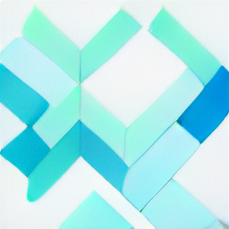

<h1 align="center"> <a href="https://share.streamlit.io/tom-doerr/dalle_flow_streamlit/main"> DALL·E Flow Streamlit </a> </h1>

<p align="center">
    
</p>

<p align="center">
    <a href="https://github.com/tom-doerr/dalle_flow_streamlit/stargazers"
        ></a>
    <a href="https://github.com/tom-doerr/dalle_flow_streamlit/issues"
        ></a>
    <a href="https://github.com/tom-doerr/dalle_flow_streamlit/blob/main/LICENSE"
        ><br />
    <a href="https://github.com/tom-doerr/dalle_flow_streamlit/commits/main"
        ></a>
    <a href="https://github.com/tom-doerr/dalle_flow_streamlit"
        ></a>

   

[Live Streamlit Website](https://share.streamlit.io/tom-doerr/dalle_flow_streamlit/main)

This project provides a frontend for Jina AI's awesome [DALL·E Flow](https://github.com/jina-ai/dalle-flow).

---

To run the streamlit app locally, you need to add a server url to the file
`.streamlit/secrets.toml`.
```
SERVER_URL=<server url>
```


